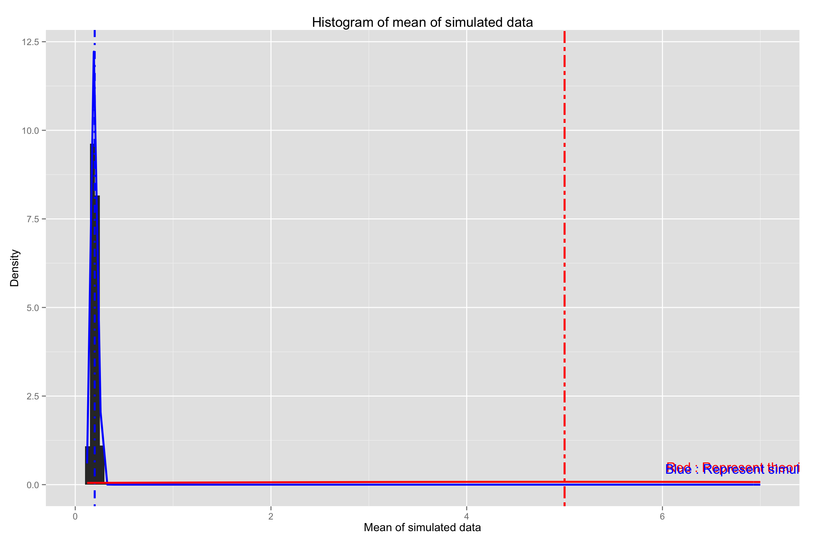

## Overview
This project investigates the simulated exponential function and compare it with the central limit theorem. Here we use R to simulate data (rexp(n,lambda)) with exponential distribution that has rate parameter(lambda) = 0.2, mean & standard deviation of 1/lambda. We will investigate the distribution of averages of 40 exponentials. In this project we will use no. of simulations = 1000.

Load R libraries

```r
library(ggplot2)
library(knitr)
```
## Data Processing
Set initial values

```r
lambda <- 0.2  # rate parameter
mn <- 1/lambda # mean of the distribution
nsample <- 40  # number of samples
sd_th <- mn/(sqrt(nsample)) # standard deviation
var_th <- sd_th^2 # variance
nsim <- 1000   # Number of simulations
```
Simulate the data

```r
set.seed(12345)  # For reproducibilty
simdata <- matrix(replicate(nsim, rexp(nsample, lambda)), nrow=nsim) # Simulated data
mean_simdata_distribution <- apply(simdata, 1, mean) # mean of each simulated data
mean_simdata <- mean(mean_simdata_distribution) # overall mean of the simulated data
sd_simdata <- sd(mean_simdata_distribution) # overall standard deviation
var_simdata <- sd_simdata^2
```
## Results
Q1. Show the sample mean and compare it to the theoretical mean of the distribution.

        Theoritical mean: 5
        
        Mean of simulated data : 4.971972
        
Q2. Show how variable the sample is (via variance) and compare it to the theoretical variance of the distribution.

        Theoretical standard deviaton: 0.7905694
        
        Theoretical variance : 0.625
        
        Standard deviation of simulated data: 0.7847246
        
        Variance of simulated data : 0.6157926
        
Q3. Show that the distribution is approximately normal.

Figure below shows the histogram of mean of simulated data. Here red line outlines the distribution and mean of the distribution with theoritical lamda=0.2 and blue line represents the distribution of the means of the simulated data. The red and blue horizontal line represents the mean of theoritical data and simulated data respectively. The plot here shows that the simulated data closely matches the data with given theoritical values. 

R code to plot histogram of the means of the simulated data.


```r
library(ggplot2)
df <- data.frame(mean_simdata_distribution)
plot <- ggplot(df, aes(x = mean_simdata_distribution)) + geom_histogram(binwidth = 0.05,aes(y = ..density..))
plot <- plot + geom_vline(xintercept=mean_simdata,size=1.0, color="blue", linetype="dotdash") +
        stat_function(fun=dnorm,args=list( mean=mean_simdata, sd=sd_simdata),color = "blue", size = 1.0)
plot <- plot +geom_vline(xintercept=mn,size=1.0,color="red",linetype = "twodash") +
        stat_function(fun=dnorm,args=list( mean=mn, sd=sd_th),color = "red", size = 1.0) + 
        ggtitle("Histogram of mean of simulated data") +xlab("Mean of simulated data") +
        ylab("Density") + annotate("text", x = 7, y = 0.5, label = "Red : Represent theoritical data", colour="red") +
        annotate("text", x = 7, y = 0.45, label = "Blue : Represent simulated data", colour="blue")
print(plot)
```

 
